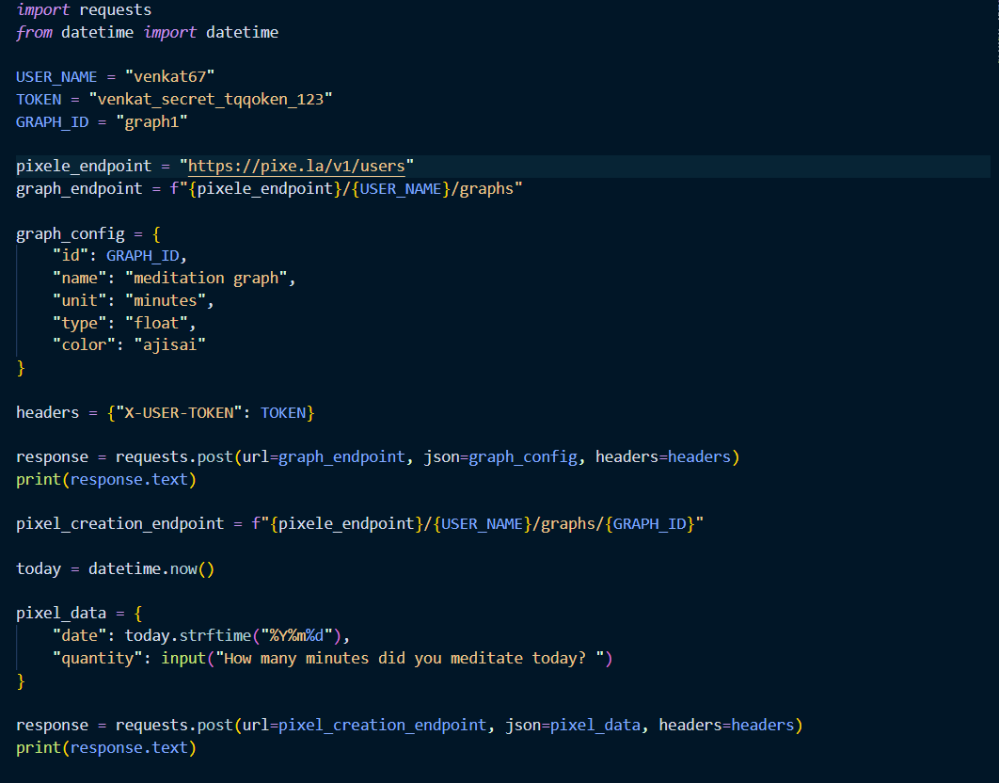
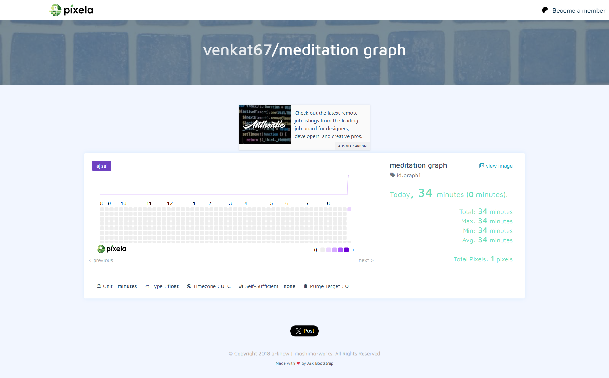
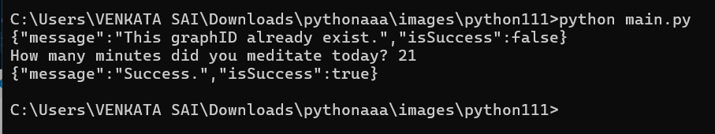

# 🧘 Meditation Tracker with Pixela

I always wanted to track my meditation, but often forgot what I did in the morning. That made it hard to remember my progress and stay consistent.  

So, I built my own **Meditation Tracker** using the [Pixela Graph API](https://pixe.la/).  
This project lets me log the number of minutes I meditate each day and see my progress visually in a graph.  

---

## ✨ Features
- Track meditation minutes daily 🕒  
- Data automatically recorded on Pixela  
- See a **beautiful graph** of your journey 📊  
- Boosts motivation to keep meditating  
- Simple Python script using `requests`  

---

## 📸 Screenshots

### 🔹 Code

### 🔹 Meditation Graph

### 🔹 Running the Script

---

## ⚙️ How It Works
1. **Create a Pixela account & token** (free).  
2. Configure your username, token, and graph ID in the Python file.  
3. Run the script daily → enter your meditation minutes.  
4. Graph updates automatically at your Pixela dashboard.  

---

## 🚀 Tech Used
- **Python** (requests, datetime)  
- **Pixela API** for graphing  

---

## 📂 Project Structure
